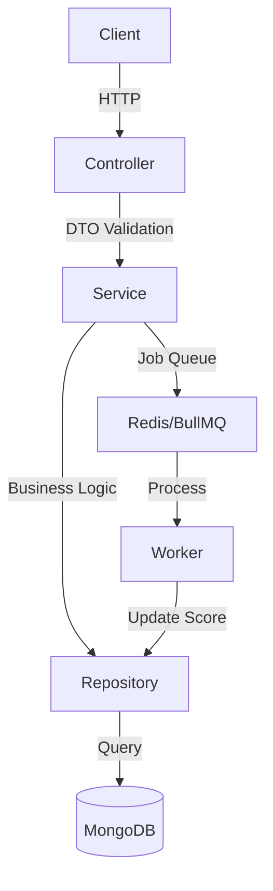

# 🚀 HireMind API

API backend para uma plataforma de entrevistas técnicas automatizadas com avaliação assíncrona de código, ranking de candidatos e arquitetura multi-tenant.

---

## 🧠 Características principais

- 🔐 **Autenticação JWT**: Fluxo seguro de login e proteção de rotas.
- 🛡️ **RBAC (Role-Based Access Control)**: Permissões distintas para `ADMIN`, `RECRUITER` e `CANDIDATE`.
- 🏢 **Multi-tenant**: Suporte a múltiplas empresas, onde recrutadores gerenciam suas próprias vagas e candidatos.
- 💼 **Gerenciamento de Vagas**: CRUD completo de oportunidades.
- 🧑‍💻 **Submissão de Código**: Candidatos podem submeter suas soluções diretamente pela API.
- ⚙️ **Processamento Assíncrono**: Avaliação de código distribuída utilizando **BullMQ + Redis**.
- 🏆 **Ranking Automático**: Sistema de score por vaga baseado no desempenho das submissões.
- 📄 **Validação Robusta**: Todos os inputs são validados via **Zod**.
- 🧱 **Arquitetura em Camadas**: Separação clara entre Controller, Service e Repository.
- 📦 **Docker Ready**: Ambiente containerizado com API, MongoDB e Redis.
- 📚 **Documentação Interativa**: Swagger UI disponível para testes rápidos.

---

## 🛠️ Tecnologias

- **Runtime**: Node.js + TypeScript
- **Framework**: Express
- **Banco de Dados**: MongoDB (Mongoose)
- **Fila/Cache**: Redis + BullMQ
- **Validação**: Zod
- **Segurança**: JWT, BcryptJS, Helmet, Cors
- **Documentação**: Swagger

---

## 🏗️ Arquitetura

O projeto segue os princípios de **Clean Architecture**, garantindo testabilidade e fácil manutenção:

1. **Controller**: Camada de entrada (HTTP), validação de DTOs e resposta ao cliente.
2. **Service**: Onde reside a lógica de negócio e orquestração de chamadas.
3. **Repository**: Abstração da camada de dados para facilitar trocas de banco de dados se necessário.
4. **Shared**: Middlewares globais, erros personalizados e utilitários.



---

## 🚀 Como Executar

### Pré-requisitos
- Docker e Docker Compose instalados.

### Passo a passo

1. **Clone o repositório e entre na pasta:**
   ```bash
   git clone <repo-url>
   cd hiremind-api
   ```

2. **Suba os containers:**
   ```bash
   docker-compose up --build
   ```

3. **Inicie os dados iniciais (Seed):**
   *(Execute em um novo terminal)*
   ```bash
   npm run seed
   ```

### 🔑 Credenciais Geradas (Seed)

| Role | Email | Senha |
| :--- | :--- | :--- |
| **ADMIN** | `admin@hiremind.com` | `123456` |
| **RECRUITER** | `recruiter@hiremind.com` | `123456` |
| **CANDIDATE** | `candidate@hiremind.com` | `123456` |

---

## 📖 API Documentation

A documentação interativa está disponível em:
👉 [http://localhost:3000/api-docs](http://localhost:3000/api-docs)

---

## 📂 Estrutura de Pastas

```text
src/
├── config/         # Configurações globais (DB, Redis, Env)
├── modules/        # Módulos da aplicação (Users, Jobs, etc.)
│   ├── [modulo]/
│   │   ├── *.controller.ts
│   │   ├── *.service.ts
│   │   ├── *.repository.ts
│   │   ├── *.model.ts
│   │   └── *.dto.ts
├── shared/         # Middlewares, Erros e Utils
├── app.ts          # Configuração do app Express
└── server.ts       # Entrada da aplicação
```

---

## 📈 Diferenciais Demonstrados

- **Processamento Distribuído**: Uso de filas para tarefas pesadas (avaliação de código).
- **Escalabilidade**: Preparado para rodar em clusters com Redis.
- **Segurança**: RBAC e validação estrita em todas as rotas.
- **Qualidade de Código**: TypeScript com tipagem forte e separação de responsabilidades.

---
Feito com ❤️ por **João Ryan** 🚀
